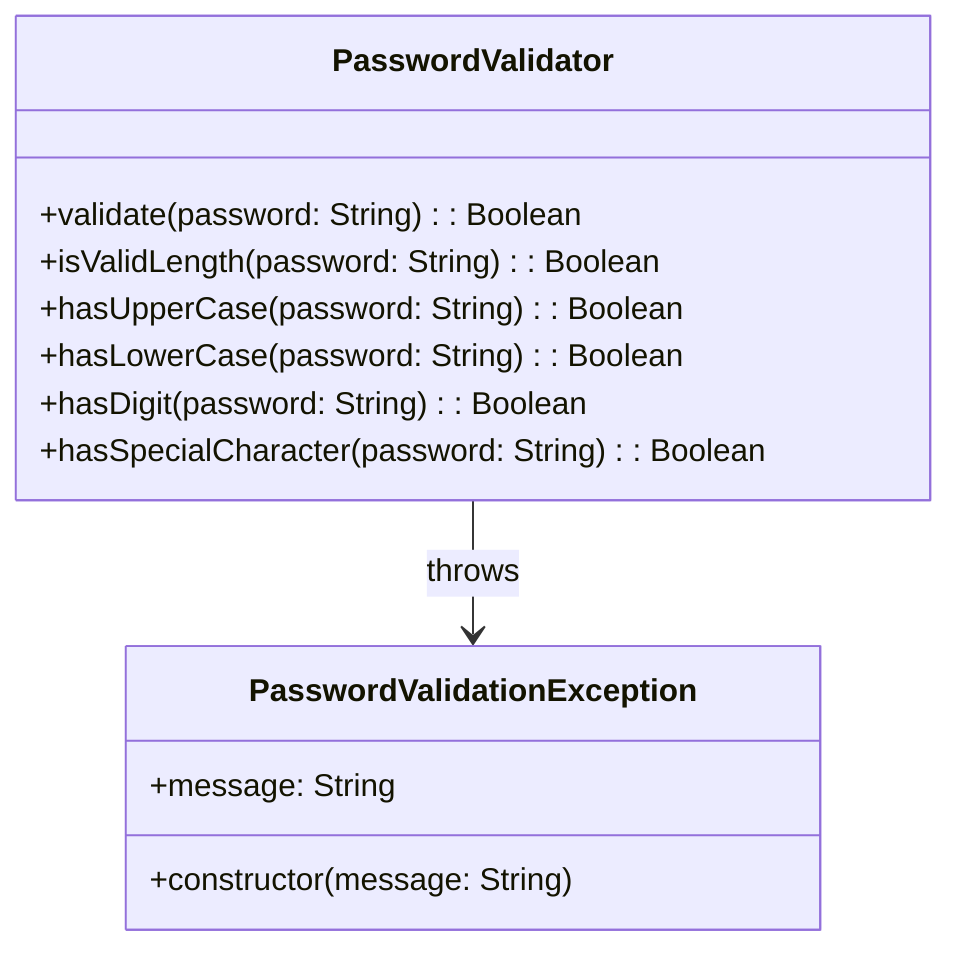

---


---

# 🌟 Secure Password Validator

The **Secure Password Validator** is a robust Maven-based project designed to ensure password security by validating them against stringent criteria. With its sleek design and strong foundations, this tool empowers users to enforce best practices for password safety.

---

## 🔒 Features

Our validator ensures passwords comply with the following rules to maximize their strength:

- **Length**: Passwords must be **at least 12 characters long**.
- **Mixed Case**: At least **one uppercase** and **one lowercase** letter are mandatory.
- **Numeric Inclusion**: Requires at least **one numerical digit**.
- **Special Characters**: Must include one of the following: `@#$%^&+=!`.
- **Whitespace Restriction**: No spaces are allowed in passwords.
- **No Repeating Sequences**: Detects and rejects repeated sequences of **three or more characters**.

---

## 🛠️ Installation Guide

Follow these steps to set up and run the **Secure Password Validator**:

### Prerequisites

Before starting, ensure you have the following installed:

1. **Java**: Version 11 or newer. You can check your version with:
   ```bash
   java -version
   ```
   If not installed, download it from [Oracle's Java Downloads](https://www.oracle.com/java/technologies/javase-downloads.html) or use your system's package manager.

2. **Maven**: Ensure Maven is installed and available. Verify with:
   ```bash
   mvn -version
   ```
   If not installed, follow the instructions at [Maven Downloads](https://maven.apache.org/download.cgi).

---

### Installation Steps

#### Clone the Repository

Clone the project to your local machine using Git:

```bash
git clone https://github.com/SinanOtc/secure-password-validator.git
```

Navigate to the project directory:

```bash
cd secure-password-validator
```

#### Build the Project

Use Maven to build the project and resolve dependencies:

```bash
mvn clean install
```

This will generate a JAR file in the `target` directory.

#### Run the Validator

Execute the application using the generated JAR file:

```bash
java -jar target/secure-password-validator.jar
```

---

### Testing the Application

Once the application is running, you can input passwords to validate them against the security criteria. The program will provide feedback indicating whether the password meets all requirements.

---

## 👩‍💻 About the Project

This project is a brainchild of **Sinan** and **Theocharis**, designed to raise the bar for password security. By enforcing strict validation rules, the Secure Password Validator empowers developers and users to create stronger, more secure passwords.

_Crafted for security, built for the future – Secure Password Validator._

---

## 📊 Class Diagram

The following class diagram illustrates the structure of the main classes in the project.


